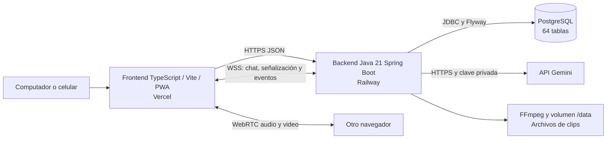
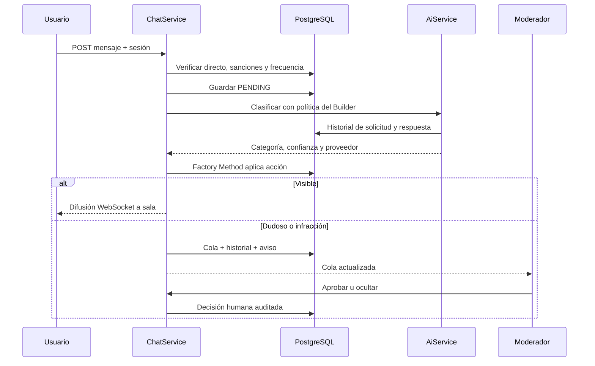

# Arquitectura y flujos

## Cuatro capas

La UI y sus eventos están escritos en `frontend/src/app.ts`. `api.ts` administra solicitudes con Fetch, sesiones y errores. `media.ts` encapsula WebRTC, MediaRecorder, voz y reproducción con tipos explícitos. `i18n.ts` importa el catálogo español y verifica las claves mediante TypeScript. HTML aporta la entrada y CSS define la presentación. Vite genera los archivos estáticos; el service worker también se escribe y compila desde TypeScript.

El frontend usa TypeScript estricto, módulos de navegador y DOM nativo. `npm run build` verifica los tipos de la UI y del worker, valida los catálogos y compila con Vite. Maven construye únicamente el backend. La migración del cliente conserva los endpoints, tokens, permisos y las migraciones PostgreSQL existentes.

El backend administra autenticación, autorización por canal, persistencia, moderación y flujos de IA. El frontend no consulta PostgreSQL ni llama a Gemini. Los archivos multimedia se guardan en un volumen y sus metadatos se relacionan en PostgreSQL.

## Mensaje de chat

La llamada de IA no mantiene bloqueada la fila del usuario: la aceptación del mensaje y la decisión final usan transacciones cortas separadas. Hay un límite de consultas concurrentes al proveedor. Los mensajes pendientes, ocultos y en revisión no se incluyen en la lista pública.

## Video y clips

El creador prepara cámara/pantalla antes de crear el directo. Solo el propietario puede unirse como emisor. Cada espectador establece una conexión WebRTC con él usando ofertas, respuestas y candidatos ICE por el backend. El backend publica presencia real. Cuando el emisor se desconecta, el directo termina; una transmisión que nunca conecta un emisor también caduca.

MediaRecorder crea segmentos independientes de aproximadamente 15 segundos y conserva un búfer breve en el navegador. Un marcador manual, un aumento de al menos 8 mensajes en 10 segundos o un aumento del nivel de audio solicita una captura al emisor. El backend valida el archivo, repara su metadata si es necesario, guarda el segmento y crea un clip pendiente. FFmpeg procesa recortes y convierte entradas MP4 a WebM.

Los archivos pendientes se sirven únicamente al propietario. Un clip aprobado se puede reproducir públicamente, descargar y compartir con un enlace de la plataforma. Después de una edición, vuelve a requerir aprobación y se conserva una versión previa.

## Permisos

| Acción | Espectador | Moderador del canal | Propietario |
|---|---|---|---|
| Ver directos y clips publicados | Sí | Sí | Sí |
| Escribir chat / seguir | Con sesión | Sí | Sí |
| Revisar cola / aplicar o retirar sanciones | No | Sí | Sí |
| Generar resumen del canal | No | Sí | Sí |
| Cambiar reglas / equipo | No | No | Sí |
| Emitir / marcar / editar y publicar clips | No | No | Sí |
| Reproducir clips pendientes | No | No | Sí |

Los permisos se comprueban en el backend por canal. Los roles globales no dan acceso a todos los canales. El registro solicita consentimiento sobre el análisis del chat. Se escapa el texto de usuarios antes de incorporarlo al HTML.

## Evolución hacia mayor audiencia

Esta versión utiliza una sola réplica, un volumen local persistente y WebRTC directo. Para aumentar la audiencia se sustituye la distribución de medios por SFU/servicio de video y CDN, se usa almacenamiento de objetos para clips y un bus compartido para eventos. La moderación podría pasar a una cola de tareas con prioridades y lotes; la clasificación y el contrato de políticas ya están separados de la infraestructura.
