# Base de datos PostgreSQL

El esquema contiene **65 tablas de dominio**. Flyway agrega `flyway_schema_history`, que no se cuenta para el requisito académico. El catálogo y las relaciones se generan desde la migración real con `scripts/document-schema.py`.

## Integridad y diseño

El modelo usa UUID, claves primarias, relaciones mediante claves foráneas, restricciones únicas, estados acotados mediante CHECK, tiempos TIMESTAMPTZ y entradas/respuestas de IA en JSONB. Un índice parcial impide dos directos activos del mismo canal. Otro evita duplicar clips para un marcador. Las listas relacionadas usan claves compuestas. Hay índices de búsqueda para salas, cola, sanciones, clips e historial, y un índice GIN para payloads de eventos.

Los permisos se comprueban por canal en servicios del backend. Los hashes de contraseñas y sesiones permanecen en PostgreSQL. En el perfil cloud, los clips se conservan como BYTEA en media_asset_contents, relacionados con media_assets. Los archivos temporales se reconstruyen al reproducir o recortar el video. Cada clip tiene un límite de 30 MiB; el espacio de la base se comparte con el resto del sistema. El modo filesystem sigue disponible para servidores con volumen persistente.

## Catálogo y alcance

**Operativa:** usada por un flujo implementado. **Catálogo:** precargada para clasificar/configurar el dominio. **Extensión:** modelo persistente preparado, sin una función completa de usuario en esta versión. Las tablas de exportación y compartidos son extensiones de seguimiento: la descarga y el enlace de compartir sí funcionan a través del archivo y el clip, sin escribir en esas tablas.

| # | Tabla | Finalidad | Alcance |
|---|---|---|---|
| 1 | `users` | Identidad, correo, credenciales y estado de la cuenta | Operativa |
| 2 | `user_profiles` | Nombre público, biografía e idioma | Operativa |
| 3 | `roles` | Catálogo de roles globales | Catálogo |
| 4 | `user_roles` | Roles asociados a cada usuario | Operativa |
| 5 | `auth_sessions` | Hash de tokens y vencimiento de sesiones | Operativa |
| 6 | `user_devices` | Inventario futuro de dispositivos | Extensión |
| 7 | `user_consents` | Consentimiento versionado para el análisis del chat | Operativa |
| 8 | `channels` | Canales y propiedad de cada comunidad | Operativa |
| 9 | `channel_settings` | Modo lento, enlaces, idioma y clips automáticos | Operativa |
| 10 | `channel_moderators` | Permisos de moderación específicos por canal | Operativa |
| 11 | `channel_follows` | Seguimiento de canales por usuarios | Operativa |
| 12 | `categories` | Categorías de transmisiones | Catálogo |
| 13 | `tags` | Etiquetas reutilizables para contenido | Extensión |
| 14 | `streams` | Título, categoría, inicio, fin y estado del directo | Operativa |
| 15 | `stream_tags` | Etiquetas asociadas a transmisiones | Extensión |
| 16 | `stream_viewer_sessions` | Ingreso y salida de espectadores conectados | Operativa |
| 17 | `stream_events` | Acontecimientos del directo con payload JSONB | Operativa |
| 18 | `chat_rooms` | Sala única para cada transmisión | Operativa |
| 19 | `chat_messages` | Mensajes persistentes y estado de moderación | Operativa |
| 20 | `message_reactions` | Reacciones a mensajes individuales | Extensión |
| 21 | `message_reports` | Reportes realizados por espectadores | Extensión |
| 22 | `moderation_policies` | Niveles, umbrales y medidas automáticas | Operativa |
| 23 | `blocked_words` | Restricciones explícitas de palabras por canal | Operativa |
| 24 | `blocked_topics` | Temas enviados como contexto a Gemini | Operativa |
| 25 | `moderation_rules` | Extensión para acciones específicas por categoría | Extensión |
| 26 | `ai_providers` | Catálogo de proveedores de IA | Catálogo |
| 27 | `ai_models` | Catálogo de modelos y capacidades | Catálogo |
| 28 | `ai_requests` | Tarea, entrada JSONB, modelo solicitado y estado | Operativa |
| 29 | `ai_responses` | Respuesta estructurada y latencia de cada solicitud | Operativa |
| 30 | `message_classifications` | Categoría, riesgo, razón y proveedor por mensaje | Operativa |
| 31 | `moderation_queue` | Casos pendientes y decisión del revisor humano | Operativa |
| 32 | `moderation_actions` | Historial de medidas y actor humano o automático | Operativa |
| 33 | `user_sanctions` | Silencios/bloqueos por canal con expiración y revocación | Operativa |
| 34 | `sanction_appeals` | Extensión para apelaciones de sanciones | Extensión |
| 35 | `user_warnings` | Advertencias resultantes de moderación automática | Operativa |
| 36 | `media_assets` | Metadatos de archivos reales asociados al propietario | Operativa |
| 37 | `recording_segments` | Intervalos de grabación asociados a archivos | Operativa |
| 38 | `stream_highlights` | Marcadores manuales, aumentos del chat y audio | Operativa |
| 39 | `clips` | Clip, video, intervalo, metadatos y estado de publicación | Operativa |
| 40 | `clip_versions` | Historial previo a ediciones y recortes | Operativa |
| 41 | `clip_tags` | Etiquetas asignadas a clips | Extensión |
| 42 | `clip_reviews` | Decisiones del propietario sobre publicación | Operativa |
| 43 | `clip_exports` | Extensión para trabajos de exportación por formato | Extensión |
| 44 | `clip_shares` | Extensión para registrar destinos compartidos | Extensión |
| 45 | `stream_summaries` | Resúmenes vinculados a su solicitud de IA | Operativa |
| 46 | `stream_topics` | Temas identificados en el contexto del directo | Operativa |
| 47 | `transcripts` | Transcripciones y su origen | Operativa |
| 48 | `subtitle_cues` | Fragmentos de texto con tiempos de inicio y fin | Operativa |
| 49 | `chat_faqs` | Preguntas y respuestas identificadas por el asistente | Operativa |
| 50 | `stream_analytics` | Muestras por minuto de audiencia y moderación | Operativa |
| 51 | `audience_reactions` | Extensión para reacciones de audiencia al directo | Extensión |
| 52 | `notifications` | Avisos privados de moderación y clips | Operativa |
| 53 | `notification_preferences` | Preferencias inicializadas para futuras entregas configurables | Operativa |
| 54 | `audit_logs` | Auditoría de configuración del canal | Operativa |
| 55 | `channel_webhooks` | Extensión para integraciones externas por evento | Extensión |
| 56 | `webhook_deliveries` | Extensión para intentos y estado de entregas | Extensión |
| 57 | `subscription_plans` | Catálogo de planes de comunidad | Catálogo |
| 58 | `channel_subscriptions` | Extensión para suscripciones de usuarios a canales | Extensión |
| 59 | `badges` | Catálogo de insignias | Catálogo |
| 60 | `user_badges` | Extensión para asignación de insignias | Extensión |
| 61 | `emotes` | Extensión para recursos y códigos de emotes | Extensión |
| 62 | `channel_emotes` | Extensión para emotes disponibles por canal | Extensión |
| 63 | `playlists` | Extensión para listas públicas o privadas del canal | Extensión |
| 64 | `playlist_items` | Extensión para clips ordenados dentro de listas | Extensión |
| 65 | `media_asset_contents` | Contenido binario de clips persistido en PostgreSQL para hosts sin disco permanente | Operativa |

## Verificar el requisito

```sql
SELECT count(*) AS domain_tables
FROM information_schema.tables
WHERE table_schema = 'streamguard' -- usar public en desarrollo local
  AND table_type = 'BASE TABLE'
  AND table_name <> 'flyway_schema_history';
-- Resultado esperado: 65
```

## Recorrido principal

`users` posee `channels`; un canal define política y moderadores y tiene `streams`. Cada directo tiene `chat_rooms` y `chat_messages`. Un mensaje puede tener clasificación, solicitud/respuesta de IA, caso de cola y acciones. Las acciones generan advertencias o sanciones. Los momentos del directo relacionan grabaciones, archivos y clips, y los clips conservan versiones y decisiones de revisión. Los resúmenes y subtítulos aportan contexto editorial y las muestras de audiencia alimentan el panel.

## Diagrama completo de relaciones

El diagrama siguiente incluye las 65 tablas y las relaciones declaradas. Los detalles de columnas, nulabilidad, claves compuestas y restricciones están en las migraciones SQL. La cardinalidad uno-a-muchos se usa como vista general de claves foráneas; las restricciones UNIQUE/PK del SQL precisan las relaciones uno-a-uno.

```mermaid
erDiagram
    users {
        UUID id
    }
    user_profiles {
        UUID user_id
    }
    roles {
        SMALLINT id
    }
    user_roles {
        UUID user_id
    }
    auth_sessions {
        UUID id
    }
    user_devices {
        UUID id
    }
    user_consents {
        UUID id
    }
    channels {
        UUID id
    }
    channel_settings {
        UUID channel_id
    }
    channel_moderators {
        UUID channel_id
    }
    channel_follows {
        UUID channel_id
    }
    categories {
        UUID id
    }
    tags {
        UUID id
    }
    streams {
        UUID id
    }
    stream_tags {
        UUID stream_id
    }
    stream_viewer_sessions {
        UUID id
    }
    stream_events {
        UUID id
    }
    chat_rooms {
        UUID id
    }
    chat_messages {
        UUID id
    }
    message_reactions {
        UUID message_id
    }
    message_reports {
        UUID id
    }
    moderation_policies {
        UUID channel_id
    }
    blocked_words {
        UUID id
    }
    blocked_topics {
        UUID id
    }
    moderation_rules {
        UUID id
    }
    ai_providers {
        UUID id
    }
    ai_models {
        UUID id
    }
    ai_requests {
        UUID id
    }
    ai_responses {
        UUID id
    }
    message_classifications {
        UUID id
    }
    moderation_queue {
        UUID id
    }
    moderation_actions {
        UUID id
    }
    user_sanctions {
        UUID id
    }
    sanction_appeals {
        UUID id
    }
    user_warnings {
        UUID id
    }
    media_assets {
        UUID id
    }
    recording_segments {
        UUID id
    }
    stream_highlights {
        UUID id
    }
    clips {
        UUID id
    }
    clip_versions {
        UUID id
    }
    clip_tags {
        UUID clip_id
    }
    clip_reviews {
        UUID id
    }
    clip_exports {
        UUID id
    }
    clip_shares {
        UUID id
    }
    stream_summaries {
        UUID id
    }
    stream_topics {
        UUID id
    }
    transcripts {
        UUID id
    }
    subtitle_cues {
        UUID id
    }
    chat_faqs {
        UUID id
    }
    stream_analytics {
        UUID id
    }
    audience_reactions {
        UUID id
    }
    notifications {
        UUID id
    }
    notification_preferences {
        UUID user_id
    }
    audit_logs {
        UUID id
    }
    channel_webhooks {
        UUID id
    }
    webhook_deliveries {
        UUID id
    }
    subscription_plans {
        UUID id
    }
    channel_subscriptions {
        UUID id
    }
    badges {
        UUID id
    }
    user_badges {
        UUID user_id
    }
    emotes {
        UUID id
    }
    channel_emotes {
        UUID channel_id
    }
    playlists {
        UUID id
    }
    playlist_items {
        UUID playlist_id
    }
    media_asset_contents {
        UUID asset_id
    }
    ai_providers ||--o{ ai_models : references
    ai_requests ||--o{ ai_responses : references
    ai_requests ||--o{ chat_faqs : references
    ai_requests ||--o{ message_classifications : references
    ai_requests ||--o{ stream_summaries : references
    badges ||--o{ user_badges : references
    categories ||--o{ streams : references
    channel_webhooks ||--o{ webhook_deliveries : references
    channels ||--o{ blocked_topics : references
    channels ||--o{ blocked_words : references
    channels ||--o{ channel_emotes : references
    channels ||--o{ channel_follows : references
    channels ||--o{ channel_moderators : references
    channels ||--o{ channel_settings : references
    channels ||--o{ channel_subscriptions : references
    channels ||--o{ channel_webhooks : references
    channels ||--o{ moderation_actions : references
    channels ||--o{ moderation_policies : references
    channels ||--o{ moderation_rules : references
    channels ||--o{ playlists : references
    channels ||--o{ streams : references
    channels ||--o{ user_sanctions : references
    channels ||--o{ user_warnings : references
    chat_messages ||--o{ message_classifications : references
    chat_messages ||--o{ message_reactions : references
    chat_messages ||--o{ message_reports : references
    chat_messages ||--o{ moderation_actions : references
    chat_messages ||--o{ moderation_queue : references
    chat_rooms ||--o{ chat_messages : references
    clips ||--o{ clip_exports : references
    clips ||--o{ clip_reviews : references
    clips ||--o{ clip_shares : references
    clips ||--o{ clip_tags : references
    clips ||--o{ clip_versions : references
    clips ||--o{ playlist_items : references
    emotes ||--o{ channel_emotes : references
    media_assets ||--o{ clip_exports : references
    media_assets ||--o{ clip_versions : references
    media_assets ||--o{ clips : references
    media_assets ||--o{ emotes : references
    media_assets ||--o{ media_asset_contents : references
    media_assets ||--o{ recording_segments : references
    media_assets ||--o{ transcripts : references
    moderation_actions ||--o{ user_sanctions : references
    moderation_actions ||--o{ user_warnings : references
    playlists ||--o{ playlist_items : references
    roles ||--o{ user_roles : references
    stream_events ||--o{ webhook_deliveries : references
    stream_highlights ||--o{ clips : references
    streams ||--o{ ai_requests : references
    streams ||--o{ audience_reactions : references
    streams ||--o{ chat_faqs : references
    streams ||--o{ chat_rooms : references
    streams ||--o{ clips : references
    streams ||--o{ recording_segments : references
    streams ||--o{ stream_analytics : references
    streams ||--o{ stream_events : references
    streams ||--o{ stream_highlights : references
    streams ||--o{ stream_summaries : references
    streams ||--o{ stream_tags : references
    streams ||--o{ stream_topics : references
    streams ||--o{ stream_viewer_sessions : references
    streams ||--o{ transcripts : references
    subscription_plans ||--o{ channel_subscriptions : references
    tags ||--o{ clip_tags : references
    tags ||--o{ stream_tags : references
    transcripts ||--o{ subtitle_cues : references
    user_sanctions ||--o{ sanction_appeals : references
    users ||--o{ audience_reactions : references
    users ||--o{ audit_logs : references
    users ||--o{ auth_sessions : references
    users ||--o{ channel_follows : references
    users ||--o{ channel_moderators : references
    users ||--o{ channel_subscriptions : references
    users ||--o{ channels : references
    users ||--o{ chat_messages : references
    users ||--o{ clip_exports : references
    users ||--o{ clip_reviews : references
    users ||--o{ clip_shares : references
    users ||--o{ clip_versions : references
    users ||--o{ emotes : references
    users ||--o{ media_assets : references
    users ||--o{ message_reactions : references
    users ||--o{ message_reports : references
    users ||--o{ moderation_actions : references
    users ||--o{ moderation_queue : references
    users ||--o{ notification_preferences : references
    users ||--o{ notifications : references
    users ||--o{ sanction_appeals : references
    users ||--o{ stream_events : references
    users ||--o{ stream_highlights : references
    users ||--o{ stream_viewer_sessions : references
    users ||--o{ user_badges : references
    users ||--o{ user_consents : references
    users ||--o{ user_devices : references
    users ||--o{ user_profiles : references
    users ||--o{ user_roles : references
    users ||--o{ user_sanctions : references
    users ||--o{ user_warnings : references
```



## Migraciones

- `V1__platform.sql`: esquema, índices y catálogos iniciales.
- `V2__clip_uniqueness.sql`: unicidad de clip por marcador e índice de segmentos.
- `V3__durable_media.sql`: bytes de clips, límite por archivo y política de acceso para el backend.

No edites una migración ya aplicada en producción. Agrega una nueva versión para cambiar el esquema. En Supabase, el esquema privado streamguard fue inicializado con V1/V2; el perfil cloud reconoce ese punto de partida y Flyway aplica V3 y versiones posteriores. El rol streamguard_backend conecta mediante el pooler de sesiones y SSL. El frontend no recibe credenciales de PostgreSQL.
