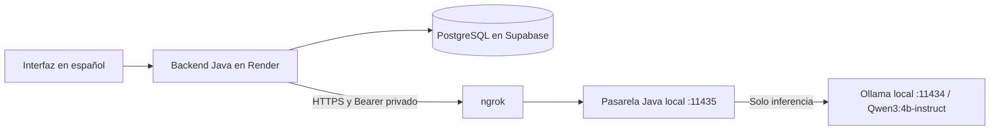

# IA local con Ollama y ngrok

StreamGuard usa **Qwen3:4b-instruct**, ejecutado por Ollama en el computador del propietario. Render conserva el backend Java; Vercel y Firebase Hosting conservan el frontend TypeScript; Supabase conserva PostgreSQL. Los visitantes no instalan el modelo.



## En este computador

El modelo y las herramientas están instalados en la carpeta de trabajo. Para reiniciarlos después de apagar Windows, abre PowerShell y ejecuta:

```powershell
cd "C:\Users\samue\OneDrive\Documentos\ChatGPT\Trabajo final patrones"
$env:JAVA_HOME = "C:\Program Files\Java\jdk-21.0.11"
powershell -ExecutionPolicy Bypass -File .\scripts\start-local-ai.ps1
```

Los procesos se ejecutan en segundo plano. Mantén el computador despierto, conectado a Internet y, preferiblemente, a corriente. No se modifica automáticamente la configuración de suspensión de Windows.

Para detener solamente estos procesos:

```powershell
powershell -ExecutionPolicy Bypass -File .\scripts\stop-local-ai.ps1
```

La web sigue disponible si el modelo o ngrok están apagados. Las restricciones locales de palabras, enlaces y repetición siguen funcionando. Los fallos de la IA generan clasificación `UNCERTAIN`, historial `FAILED` y revisión humana; los resúmenes muestran explícitamente que no se pudo obtener un análisis.

## Instalación en otro equipo Windows

1. Instala Java 21 y compila el backend con Maven, como indica `INICIO_LOCAL.md`.
2. Ejecuta `scripts/install-local-ai.ps1`. Descarga Ollama desde su repositorio oficial y comprueba SHA-256; comprueba la firma de ngrok. No instala servicios permanentes ni abre puertos en el router.
3. Crea una cuenta gratuita de ngrok y copia su authtoken únicamente en `.local/cloud/ngrok-authtoken.key`. Puedes crear y editar ese archivo con Bloc de notas. No compartas claves por chat ni GitHub.
4. Ejecuta `scripts/start-local-ai.ps1`. Descarga `qwen3:4b-instruct` si aún falta, inicia Ollama, la pasarela y el túnel. Necesitas varios GB de disco y RAM; en el equipo del propietario se usa una RTX 3050 de 6 GB con CUDA.
5. Configura en Render las cuatro variables de `.local/cloud/local-ai-render.env` y vuelve a desplegar el backend. Ese archivo es privado y está excluido de Git.

| Variable de Render | Uso |
|---|---|
| `AI_PROVIDER=ollama` | Selecciona la familia local de moderación y asistencia editorial |
| `OLLAMA_GATEWAY_URL` | Origen HTTPS de ngrok, sin ruta ni barra final |
| `OLLAMA_GATEWAY_TOKEN` | Clave Bearer privada de la pasarela, distinta del authtoken de ngrok |
| `OLLAMA_MODEL=qwen3:4b-instruct` | Modelo autorizado; debe coincidir con el de la pasarela |

Para desarrollo sin túnel, `start-local-ai.ps1 -LocalOnly` prepara una URL de loopback. El backend local admite HTTP únicamente para loopback. Render necesita la URL HTTPS de ngrok.

## Protección y límites

Ollama y la pasarela escuchan en `127.0.0.1`. ngrok expone únicamente la pasarela, que exige una clave de 256 bits, permite `/generate` y una comprobación de salud autenticada, bloquea los endpoints administrativos, fija el modelo, limita la entrada a 96 KiB y la respuesta a 64 KiB. Solo procesa una inferencia a la vez y un máximo de 60 solicitudes por minuto. Los formatos JSON del modelo se validan en el backend antes de aplicar decisiones. La inspección de cuerpos HTTP de ngrok está desactivada.

Los mensajes viajan cifrados por ngrok hasta el computador; ngrok participa en el transporte. La clave del túnel queda local. El frontend nunca recibe ninguna de estas claves. Los registros de configuración privados y los pesos del modelo están en `.local` y `.tools`, excluidos del repositorio.

Este despliegue es para demostraciones y comunidades pequeñas: una inferencia por mensaje puede introducir demora, una alta carga se envía a revisión humana y el plan gratuito de ngrok tiene cuotas. El modelo puede equivocarse y no reemplaza la revisión de moderadores. Gemini permanece como adaptador opcional para otra configuración (`AI_PROVIDER=gemini`), pero no es necesario ni se usa en esta instalación.

Referencias: [modelo y licencia](https://ollama.com/library/qwen3:4b-instruct), [Ollama en Windows](https://docs.ollama.com/windows), [API de chat y salida estructurada](https://docs.ollama.com/api/chat), [GPU](https://docs.ollama.com/gpu), [límites gratuitos de ngrok](https://ngrok.com/docs/pricing-limits/free-plan-limits).
